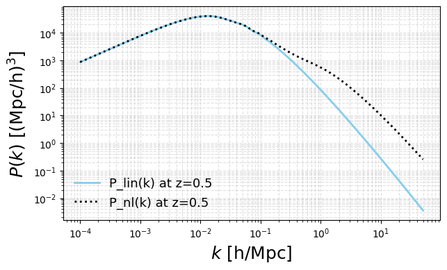

The emulator module
============

This page documents the primary public functions provided by the emulators used throughout ``hmfast``. It covers the following functions.

- ``get_hubble_at_z(z, params)`` — Evaluate the hubble parameter H(z).
- ``get_angular_distance_at_z(z, params)`` — Evaluate the angular diameter distance d_A(z).
- ``get_rho_crit_at_z(z, params)`` — Evaluate the critical density ρ_crit(z).
- ``get_pk_at_z(z, params, linear=True)`` — Return the matter power spectrum :math:`P_{\ell}(k)` if ``linear=True``, and :math:`P_{\rm nl}(k)` if ``linear=False``.

Setting up your emulator
-----------

Below are short examples showing how to call each function and plot the results.

.. code-block:: python

    import hmfast
    import jax.numpy as jnp
    import matplotlib.pyplot as plt
    
    params_hmfast = {
    
        # Emulator parameters. See https://github.com/cosmopower-organization for more details.
        'fEDE': 0.1,              # only for ede models
        'log10z_c': 3.5,
        'thetai_scf': jnp.pi/2,
        'ln10^{10}A_s': 3.047,
        'n_s': 0.965,
        'H0': 67.5,
        'omega_b': 0.02,
        'omega_cdm': 0.15,
        'r': 0.0,
        'm_ncdm': 0.06,
        'N_ur': 2.0308,
        'w0_fld': -0.95,           # only for wcdm models
    
        # Other cosmological parameters
        'T_cmb': 2.7255,
        'deg_ncdm': 1,
    
    }
    
    
    # Path to your emulator data directory
    emulator_path = "your/path/to/hmfast_data"
    
    # Create emulator container and redshift array
    emulator = hmfast.emulator_eval.Emulator(emulator_path, cosmo_model=0)
    z_grid = jnp.linspace(0.05, 20.0, 200)

Hubble parameter H(z)
-----------

This example evaluates the Hubble parameter on a redshift grid and plots it.
Adjust plotting styles to match the usage guide.

.. code-block:: python

    H_grid = emulator.get_hubble_at_z(z_grid, params=params_hmfast) * 299792.458

    label_size = 12
    title_size = 14
    legend_size = 10
    
    plt.figure(figsize=(7,4))
    plt.semilogy(z_grid, H_grid, lw=2, label=r"$H(z)$")
    plt.grid(alpha=0.4, linestyle='--')
    plt.xlabel("z", size=title_size)
    plt.ylabel("H(z) [km/s/Mpc]", size=title_size)
    plt.legend(fontsize=legend_size, frameon=False)
    plt.minorticks_on()
    plt.show()

.. image:: _static/Hz.png
   :width: 75%
   :align: center
   :alt: Hubble parameter

Angular diameter distance d_A(z)
-----------

Compute and plot the angular diameter distance for the same redshift range.

.. code-block:: python

    dA_grid = emulator.get_angular_distance_at_z(z_grid, params=params_hmfast)

    plt.figure(figsize=(7,4))
    plt.plot(z_grid, dA_grid, lw=2, color='C1', label=r"$d_A(z)$")
    plt.grid(alpha=0.4, linestyle='--')
    plt.xlabel("z", size=title_size)
    plt.ylabel("$d_A(z)$ [Mpc]", size=title_size)
    plt.legend(fontsize=legend_size, frameon=False)
    plt.minorticks_on()
    plt.show()

.. image:: _static/d_A.png
   :width: 75%
   :align: center
   :alt: Angular distance

Critical density ρ_crit(z)
-----------

Example showing how to query ρ_crit(z) and plot it. The returned units are
(approx.) (Msun/h) / (Mpc/h)^3 as used across the codebase.

.. code-block:: python

    rho_crit_grid = emulator.get_rho_crit_at_z(z_grid, params=params_hmfast)

    plt.figure(figsize=(7,4))
    plt.semilogy(z_grid, rho_crit_grid, lw=2, color='C2', label=r"$\rho_{\rm crit}(z)$")
    plt.grid(alpha=0.4, linestyle='--', which='both')
    plt.xlabel("z", size=title_size)
    plt.ylabel(r"$\rho_{\rm crit}\ \left[\frac{M_\odot/h}{\left(\mathrm{Mpc}/h\right)^3}\right]$", size=title_size)
    plt.legend(fontsize=legend_size, frameon=False)
    plt.minorticks_on()
    plt.show()

.. image:: _static/rho_crit.png
   :width: 75%
   :align: center
   :alt: Critical density

Matter power spectrum P(k) 
-----------

Use the PkEmulator to request the linear or nonlinear matter power spectrum at a given
redshift. ``get_pk_at_z`` returns (P_k, k_grid). Plot P(k) on a log-log scale.

.. code-block:: python

    # Choose redshift
    z_pk = 0.5
    
    # Linear power spectrum
    Pk_lin, k_lin = emulator.get_pk_at_z(z_pk, params=params_hmfast, linear=True)
    
    # Non-linear power spectrum (if available in your emulator files)
    Pk_nl, k_nl = emulator.get_pk_at_z(z_pk, params=params_hmfast, linear=False)
    
    plt.figure(figsize=(7,4))
    plt.loglog(k_lin, Pk_lin, lw=2, c="skyblue", label="P_lin(k) at z=0.5")
    plt.loglog(k_nl, Pk_nl, lw=2, c="black", ls=':', label="P_nl(k) at z=0.5")
    plt.grid(which='both', linestyle='--', alpha=0.4)
    plt.xlabel(r"$k\ \mathrm{[h/Mpc] }$", size=title_size)
    plt.ylabel(r"$P(k)\ \mathrm{[(Mpc/h)^3]}$", size=title_size)
    plt.legend(fontsize=legend_size, frameon=False)
    plt.minorticks_on()
    plt.show()

