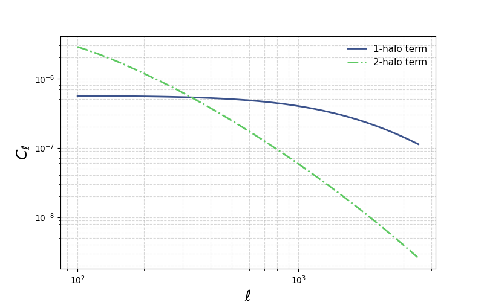

The halo model module
=====================

This page documents the primary public functions provided by the ``HaloModel`` class in ``hmfast``. It covers the following functions:

- ``get_hmf(z, m, params)`` — Returns the halo mass function :math:`\mathrm{d}n/\mathrm{d}\ln M` evaluated at redshift ``z`` and halo mass array ``m``.  
- ``get_hbf(z, m, params)`` — Returns the halo bias function :math:`b(m)` evaluated at redshift ``z`` and mass array ``m``.  
- ``get_C_ell_1h(tracer, z, m, ell, params)`` — Computes the 1-halo contribution to the angular power spectrum :math:`C_\ell` for a given tracer.  
- ``get_C_ell_2h(tracer, z, m, ell, params)`` — Computes the 2-halo contribution to the angular power spectrum :math:`C_\ell` for a given tracer.  

Setting up your halo model
--------------------------

To use the ``HaloModel`` class, you must first instantiate your cosmological parameters and load the emulator. Here's an example:

.. code-block:: python

    import hmfast 
    import jax
    import jax.numpy as jnp
    import matplotlib.pyplot as plt
    from hmfast.tracers.galaxy_hod import GalaxyHODTracer
    from hmfast.tracers.tsz import TSZTracer
    
    
    params_hmfast = {
    
        # Emulator parameters. See https://github.com/cosmopower-organization for more details.
        'fEDE': 0.1,
        'log10z_c': 3.5,
        'thetai_scf': jnp.pi/2,
        'ln10^{10}A_s': 3.047, 
        'n_s': 0.965,
        'H0': 67.5,
        'omega_b': 0.02,
        'omega_cdm': 0.15,
        'r': 0.0,
        'm_ncdm': 0.06,
        'N_ur': 2.0308,
    
        # Other cosmological parameters
        'T_cmb': 2.7255,
        'deg_ncdm': 1,
        'B': 1.4,
        'delta': 200,      
    
        # tSZ power spectrum tracer-specific params using the gNFW pressure profile.
        'P0GNFW': 8.130,
        'gammaGNFW': 0.3292,
        'alphaGNFW': 1.0620,
        'betaGNFW': 5.4807,
        'c500': 1.156,
        
        # Galaxy HOD tracer-specific params. See https://arxiv.org/pdf/2203.12583 for more details.
        'sigma_log10M_HOD': 0.68,
        'alpha_s_HOD':    1.30,
        'M1_prime_HOD': 10**12.7, # msun/h
        'M_min_HOD': 10**11.8, # msun/h
        'M0_HOD' :0,
    }

.. code-block:: python

    # Load emulators
    
    emulator = hmfast.emulator_eval.Emulator(cosmo_model=0)

    # Define the halo model
    halo_model = hmfast.halo_model.HaloModel(emulator)

    # Mass and redshift grids
    z_grid = jnp.geomspace(0.005, 3.0, 100)
    m_grid = jnp.geomspace(5e10, 3.5e15, 100)

Halo mass and bias functions
----------------------------

With our halo model defined, we can now compute halo mass and bias functions.

.. code-block:: python

    # Discrete redshifts
    z_values = [0.0, 1.0, 2.0]
    
    # Plot styling
    label_size = 17
    title_size = 18
    legend_size = 13
    
    # Colors and linestyles
    cmap = plt.get_cmap("viridis")
    colors = cmap(jnp.linspace(0.2, 0.8, len(z_values)))
    linestyles = ['-', '--', '-.']
    
    fig, axes = plt.subplots(2, 1, figsize=(8,10), sharex=True)
    
    # Top: Halo Mass Function
    for color, ls, z in zip(colors, linestyles, z_values):
        dn_dlnm = halo_model.get_hmf(z, m_grid, params=params_hmfast)
        axes[0].loglog(m_grid, dn_dlnm, lw=2, color=color, linestyle=ls, label=rf"$z={z}$")
    axes[0].grid(which='both', linestyle='--', alpha=0.5)
    axes[0].set_ylim(1e-6, 1e-1)
    axes[0].legend(fontsize=legend_size, frameon=False)
    axes[0].set_ylabel(r"$\mathrm{d}n/\mathrm{d}\ln M\ [(h^3\,\mathrm{Mpc}^{-3})]$", size=title_size)
    
    # Bottom: Halo Bias Function
    for color, ls, z in zip(colors, linestyles, z_values):
        b_m = halo_model.get_hbf(z, m_grid, params=params_hmfast)
        axes[1].loglog(m_grid, b_m, lw=2, color=color, linestyle=ls, label=rf"$z={z}$")
    axes[1].grid(which='both', linestyle='--', alpha=0.5)
    axes[1].legend(fontsize=legend_size, frameon=False)
    axes[1].set_xlabel(r"$M\ [M_\odot/h]$", size=title_size)
    axes[1].set_ylabel(r"$b(m)$", size=title_size)
    
    plt.tight_layout()
    plt.show()

.. image:: _static/hmf_hbf.png
   :width: 75%
   :align: center
   :alt: Halo mass and bias functions

Adding tracers
---------------

Once you are ready to compute angular power spectra, you can create tracer objects via the ``add_tracer`` method. Each tracer evaluates a profile over a dimensionless radial grid:

.. math::

    x = \frac{r}{r_{\rm scale}}

For tSZ tracers, the scale is the radius :math:`r_{\Delta}` (the radius enclosing :math:`\Delta` times the critical density).
For galaxy HOD tracers, the scale is the halo scale radius ``r_s`` from the NFW profile.  

This ``x_grid`` is a defining property of the tracer that cannot be changed after creation.  
If you wish to use a different radial grid, simply create a new tracer with a new ``x_grid``.

.. code-block:: python

    # Define radial grids for tracers
    x_grid_tsz = jnp.logspace(jnp.log10(1e-4), jnp.log10(20.0), 512)
    x_grid_hod = jnp.logspace(jnp.log10(1e-5), jnp.log10(50.0), 512)
    
    # Add tracers
    tsz_tracer = halo_model.create_tracer(TSZTracer, x_grid_tsz)
    galaxy_hod_tracer = halo_model.create_tracer(GalaxyHODTracer, x_grid_hod)

Angular power spectra
---------------------

You may now easily compute the 1-halo and 2-halo of your tSZ tracer:

.. code-block:: python

    # tSZ tracer
    ell_grid_tsz = jnp.geomspace(2, 8e3, 50)
    
    D_terms = [
        ('1-halo term', halo_model.get_C_ell_1h(tsz_tracer, z_grid, m_grid, ell_grid_tsz, params=params_hmfast), 0.25, '-'),
        ('2-halo term', halo_model.get_C_ell_2h(tsz_tracer, z_grid, m_grid, ell_grid_tsz, params=params_hmfast), 0.75, '-.')
    ]
    
    plt.figure(figsize=(8,5))
    cmap = plt.get_cmap("viridis")
    for label, C_ell, color_pos, ls in D_terms:
        D_ell = ell_grid_tsz*(ell_grid_tsz+1)*C_ell/(2*jnp.pi)*1e12
        plt.loglog(ell_grid_tsz, D_ell, lw=2, color=cmap(color_pos), linestyle=ls, label=label)
    
    plt.grid(which='both', linestyle='--', alpha=0.5)
    plt.minorticks_on()
    plt.legend(fontsize=13, frameon=False)
    plt.xlabel(r"$\ell$", size=18)
    plt.ylabel(r"$10^{12} D_\ell$", size=18)
    plt.tight_layout()
    plt.show()

.. image:: _static/C_ell_yy.png
   :width: 75%
   :align: center
   :alt: tSZ angular power spectrum

And similarly for your galaxy HOD tracer:

.. code-block:: python

    # Galaxy HOD tracer
    ell_grid_hod = jnp.geomspace(1e2, 3.5e3, 50)
    
    C_terms = [
        ('1-halo term', halo_model.get_C_ell_1h(galaxy_hod_tracer, z_grid, m_grid, ell_grid_hod, params=params_hmfast), 0.25, '-'),
        ('2-halo term', halo_model.get_C_ell_2h(galaxy_hod_tracer, z_grid, m_grid, ell_grid_hod, params=params_hmfast), 0.75, '-.')
    ]
    
    plt.figure(figsize=(8,5))
    cmap = plt.get_cmap("viridis")
    for label, C_ell, color_pos, ls in C_terms:
        plt.loglog(ell_grid_hod, C_ell, lw=2, color=cmap(color_pos), linestyle=ls, label=label)
    
    plt.grid(which='both', linestyle='--', alpha=0.5)
    plt.minorticks_on()
    plt.legend(fontsize=11, frameon=False)
    plt.xlabel(r"$\ell$", size=18)
    plt.ylabel(r"$C_\ell$", size=18)
    plt.tight_layout()
    plt.show()

