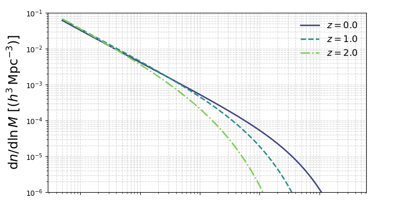
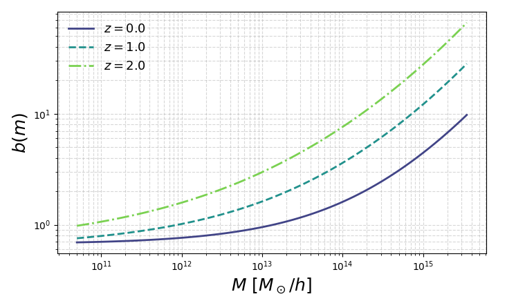
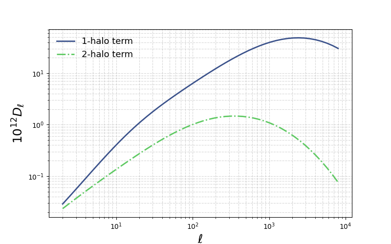

The halo model module
=====================

This page documents the primary public functions provided by the ``HaloModel`` class in ``hmfast``. It covers the following functions:

- ``get_hmf(z, m, params)`` — Returns the halo mass function :math:`\mathrm{d}n/\mathrm{d}\ln M` evaluated at redshift ``z`` and halo mass array ``m``.  
- ``get_hbf(z, m, params)`` — Returns the halo bias function :math:`b(m)` evaluated at redshift ``z`` and mass array ``m``.  
- ``get_C_ell_1h(tracer, z, m, ell, params)`` — Computes the 1-halo contribution to the angular power spectrum :math:`C_\ell` for a given tracer.  
- ``get_C_ell_2h(tracer, z, m, ell, params)`` — Computes the 2-halo contribution to the angular power spectrum :math:`C_\ell` for a given tracer.  

Setting up your halo model
--------------------------

To use the ``HaloModel`` class, you must first instantiate your halo model by specifying which emulators you wish to use. Here's an example:

.. code-block:: python

    import hmfast 
    import jax
    import jax.numpy as jnp
    import matplotlib.pyplot as plt
    
    
    params_hmfast = {
        'omega_b': 0.02,
        'omega_cdm':  0.12,
        'H0': 67.5, 
        'tau_reio': 0.0561,
        'ln10^{10}A_s': 3.047,
        'n_s': 0.9665
    }

   # Define the halo model instance
    halo_model = hmfast.halo_model.HaloModel(cosmo_model=0)

Halo mass function
----------------------------

With our halo model defined, we can now compute halo mass function. 
In this example, we will evaluate three scalar redshifts for an array of masses.
However, you can pass any configuration of arrays/scalars for mass and redshift.

.. code-block:: python

   hmf_z0 = halo_model.get_hmf(0.0, m=jnp.geomspace(5e10, 3.5e15, 100), params=params_hmfast)
   hmf_z1 = halo_model.get_hmf(1.0, m=jnp.geomspace(5e10, 3.5e15, 100), params=params_hmfast)
   hmf_z2 = halo_model.get_hmf(2.0, m=jnp.geomspace(5e10, 3.5e15, 100), params=params_hmfast)

   # ------ Plot the results ------
   m_grid = jnp.geomspace(5e10, 3.5e15, 100)
   plt.figure(figsize=(7, 4))
   plt.loglog(m_grid, hmf_z0, label=f"z = 0.0", linestyle='-', color='C0')  # Solid line
   plt.loglog(m_grid, hmf_z1, label=f"z = 1.0", linestyle='--', color='C1') # Dashed line
   plt.loglog(m_grid, hmf_z2, label=f"z = 2.0", linestyle='-.', color='C2') # Dash-dot line
   plt.ylabel(r"$\mathrm{d}n/\mathrm{d}\ln M$")
   plt.legend()
   plt.tight_layout()
   plt.show()

Halo bias function
----------------------------

We can compute the halo bias function in a similar manner.

.. code-block:: python

   hbf_z0 = halo_model.get_hbf(0.0, m=jnp.geomspace(5e10, 3.5e15, 100), params=params_hmfast)
   hbf_z1 = halo_model.get_hbf(1.0, m=jnp.geomspace(5e10, 3.5e15, 100), params=params_hmfast)
   hbf_z2 = halo_model.get_hbf(2.0, m=jnp.geomspace(5e10, 3.5e15, 100), params=params_hmfast)

   # ------ Plot the results ------
   m_grid = jnp.geomspace(5e10, 3.5e15, 100)
   plt.figure(figsize=(7, 4))
   plt.loglog(m_grid, hbf_z0, label=f"z = 0.0", linestyle='-', color='C0')  # Solid line
   plt.loglog(m_grid, hbf_z1, label=f"z = 1.0", linestyle='--', color='C1') # Dashed line
   plt.loglog(m_grid, hbf_z2, label=f"z = 2.0", linestyle='-.', color='C2') # Dash-dot line
   plt.xlabel(r"$M\ [M_\odot/h]$")
   plt.ylabel(r"$b(M)$")
   plt.legend()
   plt.tight_layout()
   plt.show()

Angular power spectra
---------------------

Once you're ready to compute the angular power spectra, you must first instantiate your tracer object as follows. 

.. code-block:: python

    # Add tracers for some x grid
    tsz_tracer = halo_model.create_tracer("y", x=jnp.logspace(jnp.log10(1e-4), jnp.log10(20.0), 512))

You may now easily compute the 1-halo and 2-halo of your tSZ tracer:

.. code-block:: python

   # --- Define ell grid and compute 1 halo and 2 halo angular power spectrum  ---
   C_ell_yy_1h = halo_model.get_C_ell_1h(tsz_tracer, z=jnp.linspace(0.05, 3.0, 100), m=jnp.geomspace(5e10, 3.5e15, 100), ell=jnp.geomspace(2, 8e3, 50), params=params_hmfast)
   C_ell_yy_1h = halo_model.get_C_ell_2h(tsz_tracer, z=jnp.linspace(0.05, 3.0, 100), m=jnp.geomspace(5e10, 3.5e15, 100), ell=jnp.geomspace(2, 8e3, 50), params=params_hmfast)

   # ------ Convert to D_ell ------
   D_ell_yy_1h = ell_grid_tsz * (ell_grid_tsz + 1) * C_ell_yy_1h / (2 * jnp.pi) * 1e12
   D_ell_yy_2h = ell_grid_tsz * (ell_grid_tsz + 1) * C_ell_yy_2h / (2 * jnp.pi) * 1e12

   # ------ Plot the results ------
   plt.figure()
   plt.loglog(ell_grid_tsz, D_ell_yy_1h, label="1-halo term")
   plt.loglog(ell_grid_tsz, D_ell_yy_2h, label="2-halo term")
   plt.xlabel(r"$\ell$")
   plt.ylabel(r"$10^{12} D_\ell$")
   plt.legend()
   plt.grid(True, which="both", linestyle="--", alpha=0.5)
   plt.show()

